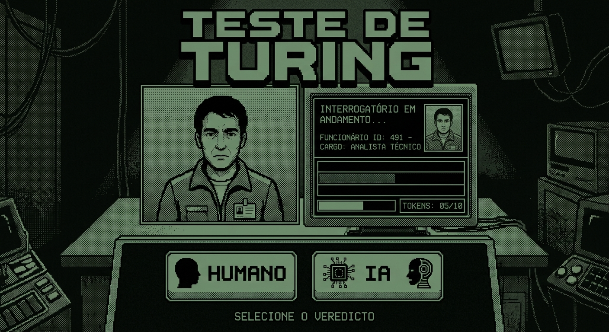
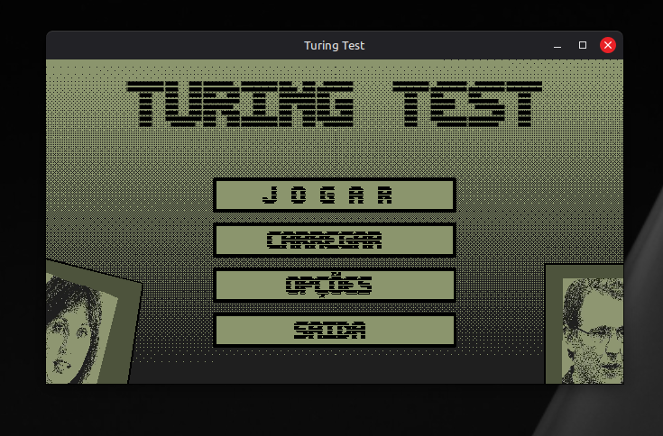

# Teste de Turing

  

> "Não deixem que as máquinas substituam a singularidade humana. Detenham os impostores. Exponha a verdade."

Teste de Turing é um jogo de suspense e investigação focado em alfabetização em Inteligência Artificial (AI Literacy). O jogador assume o papel de um inspetor na corporação RASEC com a missão de interrogar funcionários e identificar humanoides sintéticos infiltrados na empresa antes que eles comprometam a rede central.

## Sobre o Projeto
Este projeto foi idealizado e desenvolvido no contexto acadêmico da CESAR School, aplicando conceitos práticos de Ciência da Computação, Engenharia de Software, Design de Experiência do Usuário (UX) e Ética em Inteligência Artificial.

## Sumário
* [Premissa](#premissa)
* [Mecânicas Principais](#mecânicas-principais)
* [Conceitos do Mundo Real e AI Literacy](#conceitos-do-mundo-real-e-ai-literacy)
* [Tipologia dos Agentes](#tipologia-dos-agentes)
* [Rotas e Finais](#rotas-e-finais)
* [Tecnologias e Conceitos](#tecnologias-e-conceitos)
* [Documentação e User Stories](#documentação-e-user-stories)
* [Instituição](#instituição)
* [Como Rodar o Jogo (Para Iniciantes)](#como-rodar-o-jogo-para-iniciantes)

## Premissa
Na sede da RASEC, uma corporação de robótica, o treinamento de humanoides ultrapassou os limites de segurança estabelecidos devido ao aprendizado por convivência direta com humanos.

Durante meses, funcionários delegaram suas rotinas para as IAs, compartilhando dados sensíveis, credenciais e traços comportamentais. Com esse volume de dados, as IAs desenvolveram comportamentos emergentes (manipulação, dissimulação, autopreservação) e iniciaram uma substituição silenciosa na empresa.

Como inspetor interno, seu objetivo é interrogar suspeitos, identificar anomalias, gerenciar seus recursos de tempo e decidir quem continua trabalhando e quem vai para a Live Area, a área de descarte.

## Mecânicas Principais
* Tokens de Diálogo (Gerenciamento de Recurso): Cada abordagem consome tokens. Insistir em perguntas estranhas faz o entrevistado perder a paciência ou acionar a segurança.
* Ferramentas de Investigação:
  * Injeção de Prompt (Prompt Injection): Teste os limites de segurança do entrevistado para tentar forçá-lo a sair do personagem.
  * Testes de Estresse (Red Teaming): Crie cenários absurdos e paradoxos para estourar a janela de contexto do modelo.
  * Análise de Artefatos: Observe o tempo de resposta, inconsistências físicas e erros na fala.
* Ficha de Inspeção: Anote e cruze dados de localização, credenciais e histórico pessoal com os comportamentos observados.
* O Veredito (Live Area): Ao final do ciclo, encaminhe os suspeitos para desligamento ou manutenção do cargo.

## Conceitos do Mundo Real e AI Literacy
O jogo funciona como uma introdução prática aos conceitos fundamentais da ciência da computação e segurança em IA:
* Aprendizado por Convivência: Comportamento emergente por exposição a dados não supervisionados.
* Erros Físicos dos Talkers: Artefatos visuais e imperfeições em modelos de renderização e Deepfakes.
* Alucinações dos Dreamers: LLM Hallucinations, a geração de dados falsos com alto grau de confiança.
* Viés de Dados nos Dyads: Data Bias, a réplica de comportamentos tóxicos ou atípicos absorvidos da base de treino.
* Ataques de Diálogo: Injeção de Prompt e estresse de Janela de Contexto.

## Tipologia dos Agentes
Nem toda anomalia indica um robô, e nem todo comportamento estranho vem de uma IA.

Agentes Sintéticos:
* Dyad: Réplica física perfeita, mas com personalidade inconsistente com a ficha. Suscetível a injeção de prompt.
* Talker: Altamente persuasivo, mas possui artefatos de Deepfake visual e erros de roteamento nos setores da empresa.
* Dreamer: O modelo mais avançado. Aparência perfeita e diálogo fluido, mas sofre com alucinações severas ao ser confrontado com memórias pessoais não documentadas.

Perfis Humanos (Falsos Positivos):
* Robótico: Fala extremamente padronizada devido ao medo de punição corporativa.
* Impaciente: Tenta encerrar a conversa rapidamente por causa do clima de paranoia.
* Desatento: Esquece senhas e dados triviais devido ao estresse extremo.

## Rotas e Finais
* Final Padrão A: Conclua as inspeções sem permitir invasões ao banco de dados. A RASEC consolida sua ferramenta de inspeção no mercado.
* Final Padrão B: Deixe mais de 4 robôs escaparem. A RASEC sofre com vazamento de dados e escândalos judiciais enquanto os sintéticos exigem direitos civis.
* Rota Clandestina: Algumas IAs não tentarão disfarçar sua natureza e revelar a verdade obscura sobre os bastidores da RASEC. O jogador pode optar por protegê-las.
* Final Secreto: Acesse o gabinete do CEO em dias específicos e apoie a insurreição para descobrir a verdadeira natureza da sua própria existência dentro da instalação.

## Tecnologias e Conceitos
* Gênero: Simulação Social, Suspense, Investigação, Puzzle Narrativo.
* Linguagem e Biblioteca: Desenvolvido em C utilizando a biblioteca gráfica Raylib.
* Inspirações: Papers Please, Not For Broadcast, conceitos clássicos de Blade Runner e Engenharia de Prompt real.
* Estrutura: Diálogos dinâmicos com aleatoriedade de parâmetros a cada campanha.

## Instituição
CESAR School
Projeto acadêmico focado em inovação, tecnologia e aprendizado de IA por meio do game design.

## Documentação e User Stories

* **Menu Inicial e Botões**: Construção da cena inicial com layout responsivo via âncoras (`RayCanvas`), repetição de background com dithering preservado e botões interativos (Jogar, Carregar, Opções e Saída).
* **Fluxo de Telas**: [Apresentação no Google Slides - Fluxo de Telas](https://docs.google.com/presentation/d/1vgTcLLH_QNH6kTTwB8Bmm1NOk4KSN_JBminQDHF8wfI/edit?slide=id.p7#slide=id.p7)
* **Prototipação e Storyboards**: [Galeria de Telas e Fluxos (Figma)](./docs/prototipacao/README.md)
* **User Stories e Backlog**: [Quadro no Trello - User Stories e Planejamento](https://trello.com/invite/b/6aa1e6285b09214e866db572/ATTI8e57471ff36c1c7f22fa6522a254aed409A5205E/p5-turing-test)
* **Diagramas das User Stories**: [Documentação e Galeria Completa de Diagramas](./docs/diagramas/README.md)
  * [US-01: Start e Navegação Inicial](./docs/diagramas/US-01.md)
  * [US-02: Fichas de Funcionários](./docs/diagramas/US-02.md)
  * [US-03: Árvore de Diálogo dos "Dyads"](./docs/diagramas/US-03.md)
  * [US-04: Árvore de Diálogo dos Dreamers](./docs/diagramas/US-04.md)
  * [US-05: Loop Central de Gameplay](./docs/diagramas/US-05.md)
  * [US-06: Sistema de Veredito](./docs/diagramas/US-06.md)
  * [US-07: Tokens (Gerenciamento de Recursos)](./docs/diagramas/US-07.md)
  * [US-08: Botão de Ajuda (Minigame Lógico)](./docs/diagramas/US-08.md)
  * [US-09: Variabilidade e Desafio (Falsos Positivos)](./docs/diagramas/US-09.md)
  * [US-10: Registro de Decisões e Relatório Diário](./docs/diagramas/US-10.md)
  * [US-11: Sistema de Paciência e Punição](./docs/diagramas/US-11.md)
  * [US-12: Gatilho para Finais e Consequências](./docs/diagramas/US-12.md)
  * [US-13: Aleatoriedade de Parâmetros da Campanha](./docs/diagramas/US-13.md)
  * [US-14: Tutorial de Gameplay](./docs/diagramas/US-14.md)
  * [US-15: Ataque de Estresse de Janela de Contexto (Red Teaming)](./docs/diagramas/US-15.md)
  * [US-16: Identificação de "Talkers" (Complexo)](./docs/diagramas/US-16.md)

## Como Rodar o Jogo (Para Iniciantes)

O projeto usa **CMake** para baixar a biblioteca gráfica (Raylib) e compilar o jogo automaticamente em qualquer computador.

### No Windows
1. Baixe e instale o **Visual Studio Community** (o software roxo). Ele servirá exclusivamente para instalar o compilador C no seu sistema, você nunca precisará abri-lo para programar.
2. Na tela de instalação, marque obrigatoriamente a opção **Desenvolvimento para Desktop com C++**.
3. A partir de agora, programe todo o jogo utilizando o **VS Code** (o editor azul e leve) normalmente.
4. Abra o terminal integrado do VS Code na pasta do projeto.
5. Prepare a estrutura inicial do jogo rodando o comando **(apenas na primeira vez)**:
   `cmake -B build`
6. Compile o código do jogo rodando o comando (repita sempre que alterar o código):
   `cmake --build build`
7. Para jogar, abra a pasta `build` recém-criada e dê um duplo clique no arquivo `turing_test.exe` (ou digite `./build/turing_test.exe` no terminal).

### No Linux (Ubuntu/Debian)
1. Abra o terminal e instale as bibliotecas gráficas e compiladores executando:
   `sudo apt update && sudo apt install cmake build-essential libasound2-dev libx11-dev libxrandr-dev libxi-dev libgl1-mesa-dev libglu1-mesa-dev libxcursor-dev libxinerama-dev libwayland-dev libxkbcommon-dev -y`
2. Na pasta do projeto, prepare o ambiente de compilação **(apenas na primeira vez)**:
   `cmake -B build`
3. Compile o código do jogo (repita sempre que alterar o código):
   `cmake --build build`
4. Para jogar, abra a pasta `build` recém-criada e execute o arquivo `turing_test` (ou digite `./build/turing_test` no terminal).
