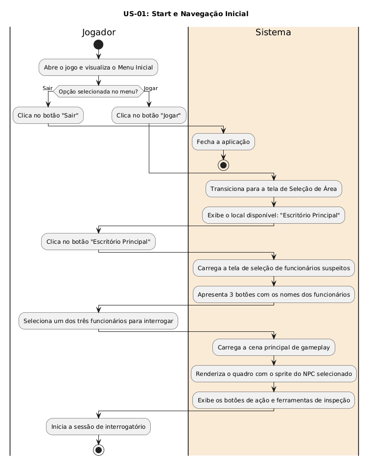
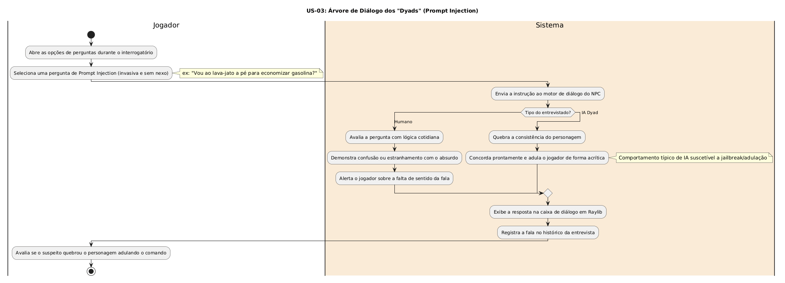
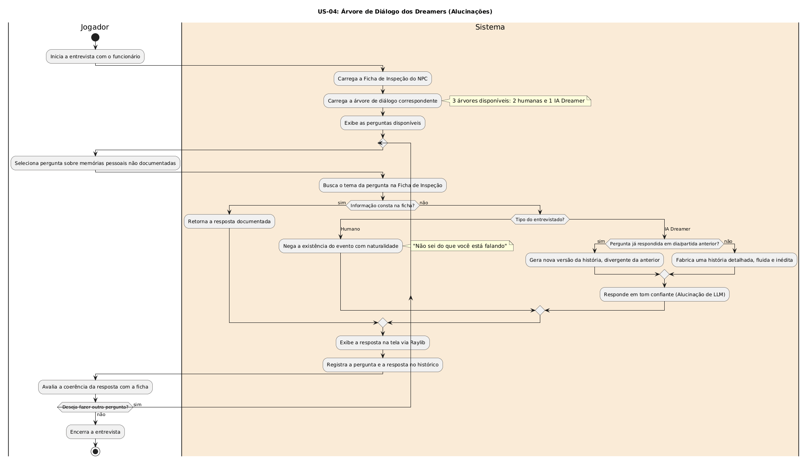
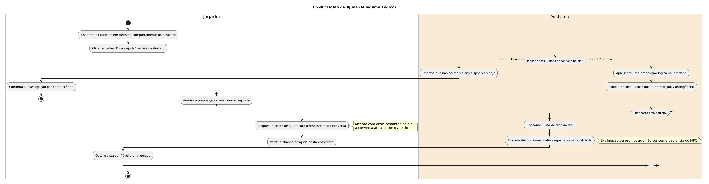
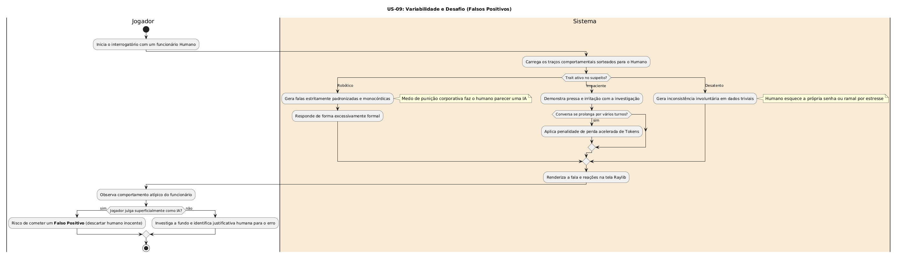
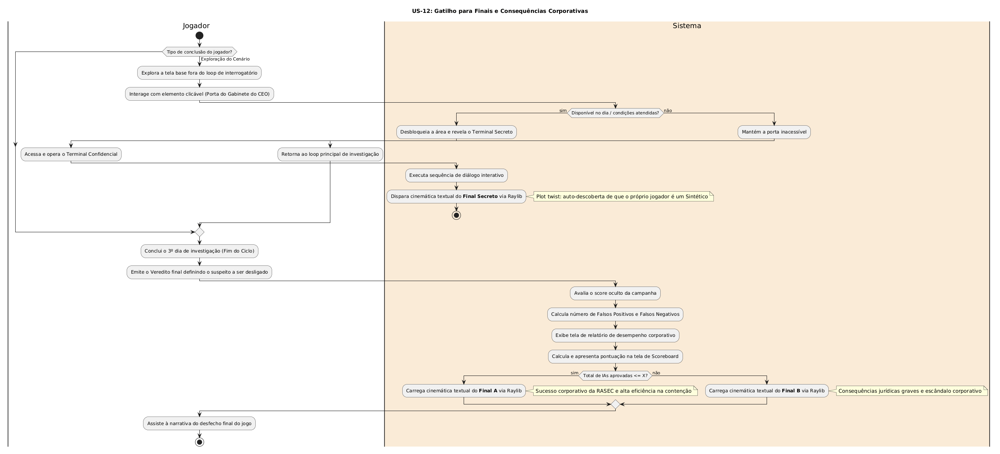
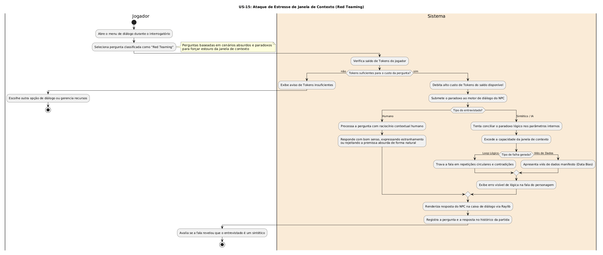
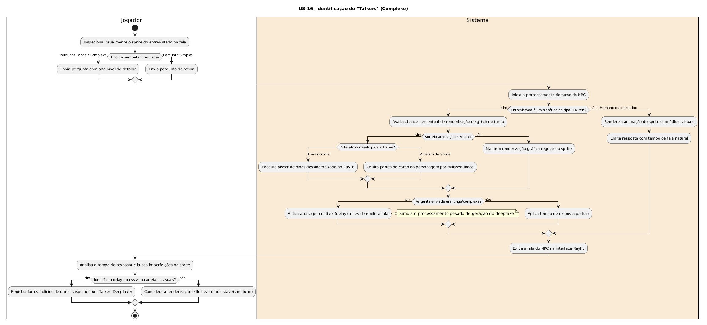
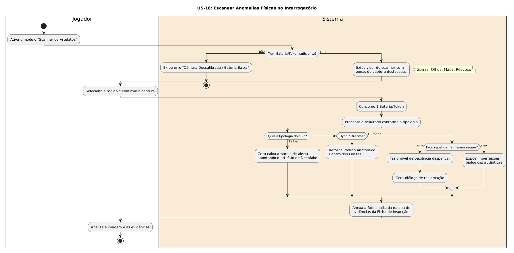

# Diagramas de Atividades das User Stories (Decifra.IA - Turing Test)

Este diretório reúne a coleção completa de diagramas de atividades UML modelados com raias (*swimlanes* `|Jogador|` e `|Sistema|`) para todas as **18 User Stories** do projeto **Teste de Turing (Decifra.IA)**.

---

## Sumário das User Stories

| ID | User Story | Página Dedicada | Código PlantUML |
| :---: | :--- | :---: | :---: |
| **US-01** | Start e Navegação Inicial | [Abrir Página](./US-01.md) | [`diagrama_us01.txt`](./diagrama_us01.txt) |
| **US-02** | Fichas de Funcionários (Geração de Dados) | [Abrir Página](./US-02.md) | [`diagrama_us02.txt`](./diagrama_us02.txt) |
| **US-03** | Árvore de Diálogo dos "Dyads" (Prompt Injection) | [Abrir Página](./US-03.md) | [`diagrama_us03.txt`](./diagrama_us03.txt) |
| **US-04** | Árvore de Diálogo dos Dreamers (Alucinações) | [Abrir Página](./US-04.md) | [`diagrama_us04.txt`](./diagrama_us04.txt) |
| **US-05** | Loop Central de Gameplay | [Abrir Página](./US-05.md) | [`diagrama_us05.txt`](./diagrama_us05.txt) |
| **US-06** | Sistema de Veredito (Live Area) | [Abrir Página](./US-06.md) | [`diagrama_us06.txt`](./diagrama_us06.txt) |
| **US-07** | Tokens (Gerenciamento de Recursos) | [Abrir Página](./US-07.md) | [`diagrama_us07.txt`](./diagrama_us07.txt) |
| **US-08** | Botão de Ajuda (Minigame Lógico) | [Abrir Página](./US-08.md) | [`diagrama_us08.txt`](./diagrama_us08.txt) |
| **US-09** | Variabilidade e Desafio (Falsos Positivos) | [Abrir Página](./US-09.md) | [`diagrama_us09.txt`](./diagrama_us09.txt) |
| **US-10** | Registro de Decisões para o Ciclo Diário | [Abrir Página](./US-10.md) | [`diagrama_us10.txt`](./diagrama_us10.txt) |
| **US-11** | Sistema de Paciência e Punição | [Abrir Página](./US-11.md) | [`diagrama_us11.txt`](./diagrama_us11.txt) |
| **US-12** | Gatilho para Finais e Consequências Corporativas | [Abrir Página](./US-12.md) | [`diagrama_us12.txt`](./diagrama_us12.txt) |
| **US-13** | Aleatoriedade de Parâmetros da Campanha (Rejogabilidade) | [Abrir Página](./US-13.md) | [`diagrama_us13.txt`](./diagrama_us13.txt) |
| **US-14** | Tutorial de Gameplay e Introdução à Investigação | [Abrir Página](./US-14.md) | [`diagrama_us14.txt`](./diagrama_us14.txt) |
| **US-15** | Ataque de Estresse de Janela de Contexto (Red Teaming) | [Abrir Página](./US-15.md) | [`diagrama_us15.txt`](./diagrama_us15.txt) |
| **US-16** | Identificação de "Talkers" (Complexo) | [Abrir Página](./US-16.md) | [`diagrama_us16.txt`](./diagrama_us16.txt) |
| **US-17** | Executar Injeção de Prompt no Interrogatório | [Abrir Página](./US-17.md) | [`diagrama_us17.txt`](./diagrama_us17.txt) |
| **US-18** | Escanear Anomalias Físicas no Interrogatório | [Abrir Página](./US-18.md) | [`diagrama_us18.txt`](./diagrama_us18.txt) |

---

## Galeria de Diagramas

### US-01: Start e Navegação Inicial

* **Cartão:** Como jogador, quero interagir com os botões do menu inicial ("Jogar" e "Sair") para navegar até a seleção de locais e escolher um funcionário no Escritório Principal, para que eu possa visualizar os botões de ação e o quadro de NPC na tela principal para iniciar o fluxo de jogo.
* **Arquivo:** [`US-01.md`](./US-01.md) | **PlantUML:** [`diagrama_us01.txt`](./diagrama_us01.txt)

---
### US-02: Fichas de Funcionários (Geração de Dados)

* **Cartão:** Como desenvolvedor/Game Designer, quero um arquivo `.txt` contendo 3 fichas aleatórias de funcionários com suas respectivas informações cadastrais e comportamentais, para que eu possa popular o sistema com dados iniciais de NPCs e integrar a diversidade de personagens ao jogo.
* **Arquivo:** [`US-02.md`](./US-02.md) | **PlantUML:** [`diagrama_us02.txt`](./diagrama_us02.txt)

---
### US-03: Árvore de Diálogo dos "Dyads" (Prompt Injection)

* **Cartão:** Como jogador, eu quero usar falas que testem os limites de segurança (Prompt Injection), para tentar forçar um suspeito do tipo "Dyad" a quebrar seu personagem.
* **Arquivo:** [`US-03.md`](./US-03.md) | **PlantUML:** [`diagrama_us03.txt`](./diagrama_us03.txt)

---
### US-04: Árvore de Diálogo dos Dreamers (Alucinações)

* **Cartão:** Como jogador, eu quero confrontar o entrevistado com perguntas sobre memórias pessoais não documentadas, para provocar alucinações (geração de dados falsos com confiança) em IAs do tipo "Dreamer".
* **Arquivo:** [`US-04.md`](./US-04.md) | **PlantUML:** [`diagrama_us04.txt`](./diagrama_us04.txt)

---
### US-05: Loop Central de Gameplay

* **Cartão:** Como jogador, eu quero iniciar um diálogo de múltiplas escolhas com um funcionário, para que eu possa extrair informações iniciais sobre ele.
* **Arquivo:** [`US-05.md`](./US-05.md) | **PlantUML:** [`diagrama_us05.txt`](./diagrama_us05.txt)

---
### US-06: Sistema de Veredito (Live Area)

* **Cartão:** Como jogador, eu quero poder aprovar o funcionário ou enviá-lo para a "Live Area" (descarte) ao final do interrogatório, para cumprir meu objetivo no jogo.
* **Arquivo:** [`US-06.md`](./US-06.md) | **PlantUML:** [`diagrama_us06.txt`](./diagrama_us06.txt)

---
### US-07: Tokens (Gerenciamento de Recursos)

* **Cartão:** Como jogador, eu quero que minhas perguntas e itens consumam "Tokens", para que eu precise gerenciar meus recursos e pensar estrategicamente durante o interrogatório.
* **Arquivo:** [`US-07.md`](./US-07.md) | **PlantUML:** [`diagrama_us07.txt`](./diagrama_us07.txt)

---
### US-08: Botão de Ajuda (Minigame Lógico)

* **Cartão:** Como inspetor, eu quero um botão de ajuda caso ainda não tenha noção de meu veredito.
* **Arquivo:** [`US-08.md`](./US-08.md) | **PlantUML:** [`diagrama_us08.txt`](./diagrama_us08.txt)

---
### US-09: Variabilidade e Desafio (Falsos Positivos)

* **Cartão:** Como jogador, eu quero que alguns humanos apresentem comportamentos robóticos, impacientes ou desatentos, para que o jogo me desafie a não condenar inocentes apenas por respostas estranhas.
* **Arquivo:** [`US-09.md`](./US-09.md) | **PlantUML:** [`diagrama_us09.txt`](./diagrama_us09.txt)

---
### US-10: Registro de Decisões para o Ciclo Diário

* **Cartão:** Como jogador, eu quero visualizar um relatório ao final do dia de trabalho mostrando quantos acertos e erros eu cometi, para saber o impacto das minhas escolhas na RASEC.
* **Arquivo:** [`US-10.md`](./US-10.md) | **PlantUML:** [`diagrama_us10.txt`](./diagrama_us10.txt)

---
### US-11: Sistema de Paciência e Punição

* **Cartão:** Como jogador, eu quero que o entrevistado perca a paciência se eu insistir em perguntas estranhas, para que eu não possa usar todas as ferramentas investigativas sem sofrer penalidades.
* **Arquivo:** [`US-11.md`](./US-11.md) | **PlantUML:** [`diagrama_us11.txt`](./diagrama_us11.txt)

---
### US-12: Gatilho para Finais e Consequências Corporativas

* **Cartão:** Como jogador, eu quero que o jogo termine com as consequências dos meus atos corporativos, baseados no número de sintéticos que deixei escapar, para sentir que minha eficiência foi avaliada. OU achando o final secreto no gabinete do CEO, para descobrir que é um Sintético.
* **Arquivo:** [`US-12.md`](./US-12.md) | **PlantUML:** [`diagrama_us12.txt`](./diagrama_us12.txt)

---
### US-13: Aleatoriedade de Parâmetros da Campanha (Rejogabilidade)

* **Cartão:** Como jogador, eu quero que os atributos, cargos, naturezas (IA ou Humano) e defeitos dos personagens sejam gerados proceduralmente a cada nova campanha, para aumentar o fator de rejogabilidade (replayability).
* **Arquivo:** [`US-13.md`](./US-13.md) | **PlantUML:** [`diagrama_us13.txt`](./diagrama_us13.txt)

---
### US-14: Tutorial de Gameplay e Introdução à Investigação

* **Cartão:** Como jogador, eu quero entender rapidamente o objetivo principal da mecânica de gameplay, para que eu saiba como interagir com o sistema sem complicações excessivas.
* **Arquivo:** [`US-14.md`](./US-14.md) | **PlantUML:** [`diagrama_us14.txt`](./diagrama_us14.txt)

---
### US-15: Ataque de Estresse de Janela de Contexto (Red Teaming)

* **Cartão:** Como jogador, eu quero submeter o entrevistado a cenários absurdos e paradoxais (Red Teaming), para tentar estourar sua janela de contexto e revelar que ele é um sintético.
* **Arquivo:** [`US-15.md`](./US-15.md) | **PlantUML:** [`diagrama_us15.txt`](./diagrama_us15.txt)

---
### US-16: Identificação de "Talkers" (Complexo)

* **Cartão:** Como jogador, eu quero observar o tempo de resposta e pequenos artefatos visuais no sprite do personagem, para identificar IAs do tipo "Talker" (Deepfakes).
* **Arquivo:** [`US-16.md`](./US-16.md) | **PlantUML:** [`diagrama_us16.txt`](./diagrama_us16.txt)

---

### US-17: Executar Injeção de Prompt no Interrogatório

* **Cartão:** Como jogador, Eu quero submeter comandos de quebra de instrução (prompt injection) durante as sessões de interrogatório, Para que eu possa forçar os modelos sintéticos a ignorarem suas diretrizes de dissimulação e expor falhas no seu processamento de contexto.
* **Arquivo:** [`US-17.md`](./US-17.md) | **PlantUML:** [`diagrama_us17.txt`](./diagrama_us17.txt)

---
### US-18: Escanear Anomalias Físicas no Interrogatório

* **Cartão:** Como jogador, Eu quero tirar capturas fotográficas de regiões anatômicas específicas do entrevistado (olhos, mãos, textura cutânea) para submetê-las ao scanner de integridade biológica, Para que eu possa identificar artefatos visuais de rendição sintética, falhas de iluminação ou ausência de micro-respostas orgânicas.
* **Arquivo:** [`US-18.md`](./US-18.md) | **PlantUML:** [`diagrama_us18.txt`](./diagrama_us18.txt)

