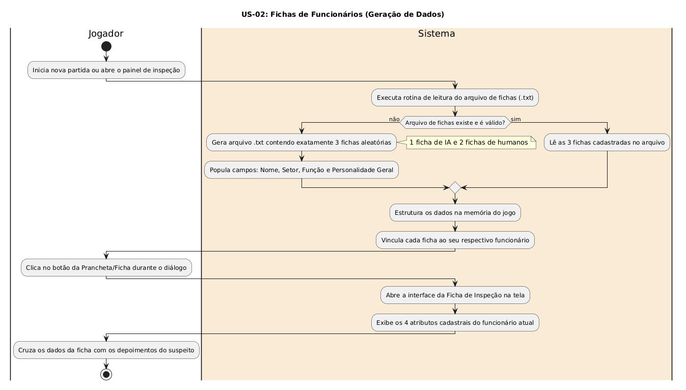

# US-02: Fichas de Funcionários (Geração de Dados)

[← Voltar para a lista de diagramas](./README.md)

### Cartão
> Como desenvolvedor/Game Designer, quero um arquivo `.txt` contendo 3 fichas aleatórias de funcionários com suas respectivas informações cadastrais e comportamentais, para que eu possa popular o sistema com dados iniciais de NPCs e integrar a diversidade de personagens ao jogo.

### Conversa
* Geração aleatória de exatamente 3 fichas completas (1 IA e 2 humanos) contendo Nome, Setor, Função e Personalidade Geral em formato estruturado.

### Confirmação
* Arquivo .txt gerado com 3 fichas distintas; cada ficha contém Nome, Setor, Função e Personalidade; cruzamento de dados na interface de inspeção durante a gameplay.

---

### Diagrama de Atividades (UML)

* **Código-fonte:** [`diagrama_us02.txt`](./diagrama_us02.txt)

