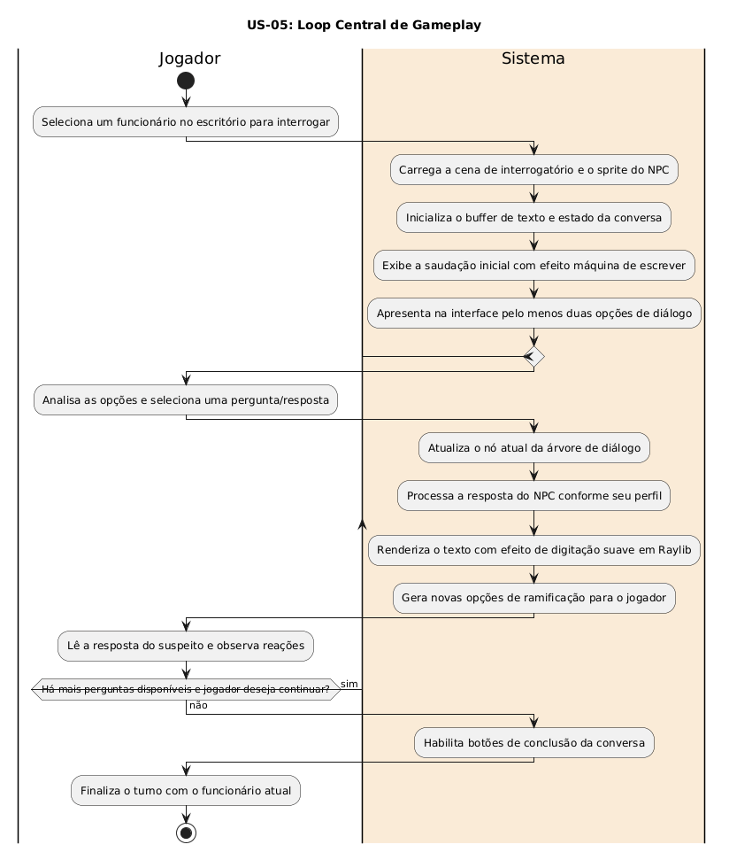

# US-05: Loop Central de Gameplay

[← Voltar para a lista de diagramas](./README.md)

### Cartão
> Como jogador, eu quero iniciar um diálogo de múltiplas escolhas com um funcionário, para que eu possa extrair informações iniciais sobre ele.

### Conversa
* Interface em Raylib com texto fluido (efeito máquina de escrever) e apresentação clara de pelo menos duas opções de resposta para conduzir o interrogatório.

### Confirmação
* Clique no funcionário inicia interação; exibição de falas do NPC e opções de resposta; avanço da árvore de diálogo conforme escolhas do jogador.

---

### Diagrama de Atividades (UML)

* **Código-fonte:** [`diagrama_us05.txt`](./diagrama_us05.txt)

