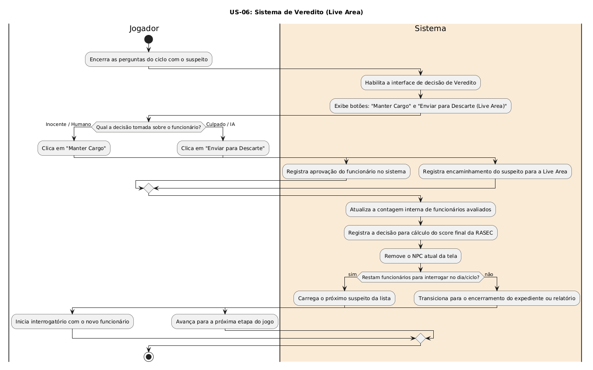

# US-06: Sistema de Veredito (Live Area)

[← Voltar para a lista de diagramas](./README.md)

### Cartão
> Como jogador, eu quero poder aprovar o funcionário ou enviá-lo para a "Live Area" (descarte) ao final do interrogatório, para cumprir meu objetivo no jogo.

### Conversa
* Mecânica de conclusão do loop do NPC. Botões que permitem ao jogador tomar a decisão e registrar no sistema para cálculo do score final.

### Confirmação
* Ao fim do interrogatório, surgem botões 'Manter Cargo' e 'Enviar para Descarte'; registro da decisão no sistema; transição para o próximo suspeito.

---

### Diagrama de Atividades (UML)

* **Código-fonte:** [`diagrama_us06.txt`](./diagrama_us06.txt)

