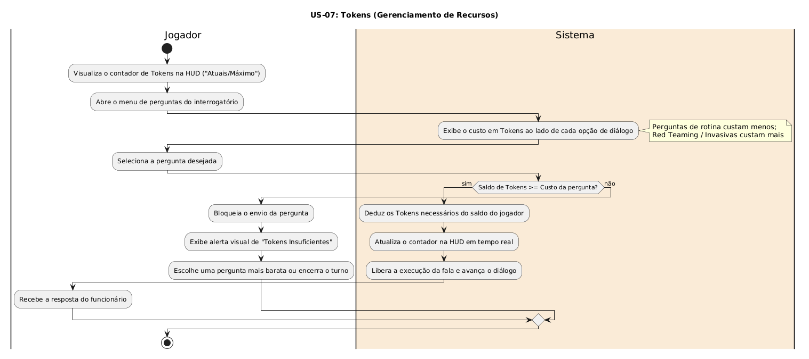

# US-07: Tokens (Gerenciamento de Recursos)

[← Voltar para a lista de diagramas](./README.md)

### Cartão
> Como jogador, eu quero que minhas perguntas e itens consumam "Tokens", para que eu precise gerenciar meus recursos e pensar estrategicamente durante o interrogatório.

### Conversa
* Balanceamento de tokens recebidos por turno/dia. Perguntas invasivas (Red Teaming, Prompt Injection) custam mais tokens do que perguntas de rotina.

### Confirmação
* Contador de tokens na HUD (Atuais/Máximo); custo visível em cada opção de diálogo; bloqueio de envio caso o saldo seja insuficiente.

---

### Diagrama de Atividades (UML)

* **Código-fonte:** [`diagrama_us07.txt`](./diagrama_us07.txt)

