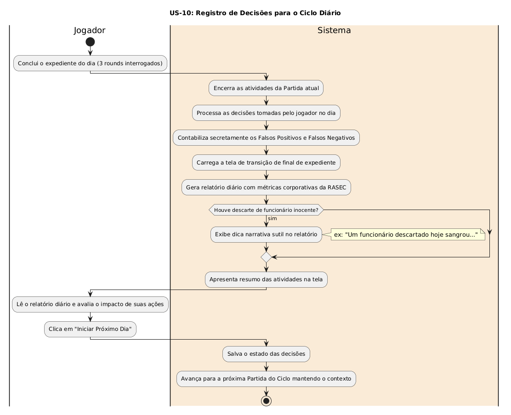

# US-10: Registro de Decisões para o Ciclo Diário

[← Voltar para a lista de diagramas](./README.md)

### Cartão
> Como jogador, eu quero visualizar um relatório ao final do dia de trabalho mostrando quantos acertos e erros eu cometi, para saber o impacto das minhas escolhas na RASEC.

### Conversa
* Tela de transição entre dias/partidas. Contabilização secreta de falsos positivos e falsos negativos, com dicas narrativas sutis (ex: 'Um funcionário descartado hoje sangrou').

### Confirmação
- [ ] Relatório exibido ao final de cada expediente
- [ ] rastreamento de decisões para desfecho narrativo da campanha.

---

### Diagrama de Atividades (UML)

* **Código-fonte:** [`diagrama_us10.txt`](./diagrama_us10.txt)

