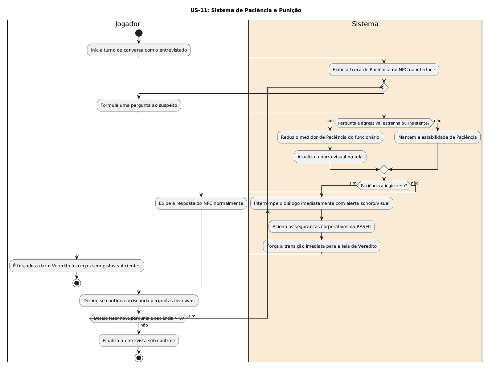

# US-11: Sistema de Paciência e Punição

[← Voltar para a lista de diagramas](./README.md)

### Cartão
> Como jogador, eu quero que o entrevistado perca a paciência se eu insistir em perguntas estranhas, para que eu não possa usar todas as ferramentas investigativas sem sofrer penalidades.

### Conversa
* Atributo de Paciência para cada NPC. Perguntas agressivas/estranhas reduzem a barra. Ao chegar a zero, o funcionário aciona a segurança da RASEC e força o Veredito às cegas.

### Confirmação
- [ ] Perguntas invasivas reduzem medidor de paciência
- [ ] ao zerar, o diálogo é interrompido com alerta corporativo e a tela de Veredito é imposta.

---

### Diagrama de Atividades (UML)

* **Código-fonte:** [`diagrama_us11.txt`](./diagrama_us11.txt)

