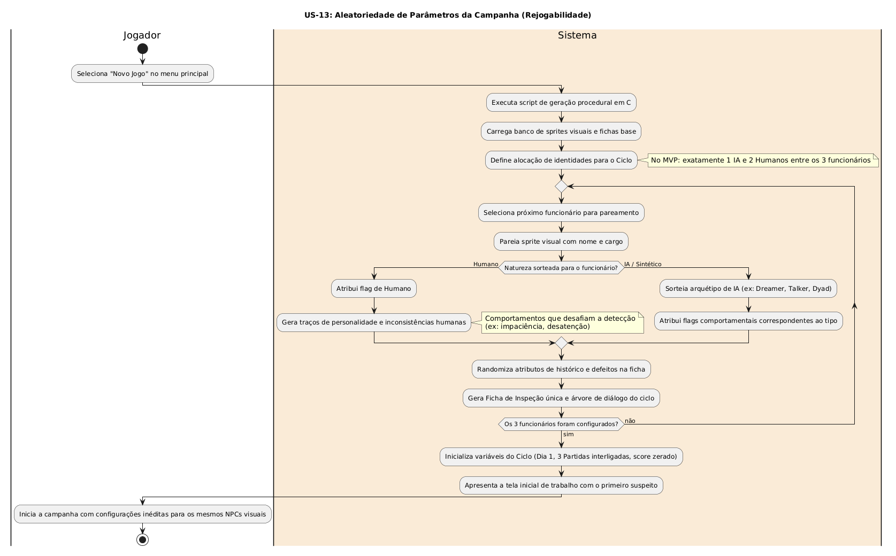

# US-13: Aleatoriedade de Parâmetros da Campanha (Rejogabilidade)

[← Voltar para a lista de diagramas](./README.md)

### Cartão
> Como jogador, eu quero que os atributos, cargos, naturezas (IA ou Humano) e defeitos dos personagens sejam gerados proceduralmente a cada nova campanha, para aumentar o fator de rejogabilidade (replayability).

### Conversa
* Script em C no início de 'Novo Jogo' para parear sprites, nomes, fichas e flags (ex: 1 IA e 2 Humanos a cada ciclo).

### Confirmação
- [ ] Iniciar nova campanha gera configurações únicas e imprevisíveis para os mesmos NPCs visuais.

---

### Diagrama de Atividades (UML)

* **Código-fonte:** [`diagrama_us13.txt`](./diagrama_us13.txt)

