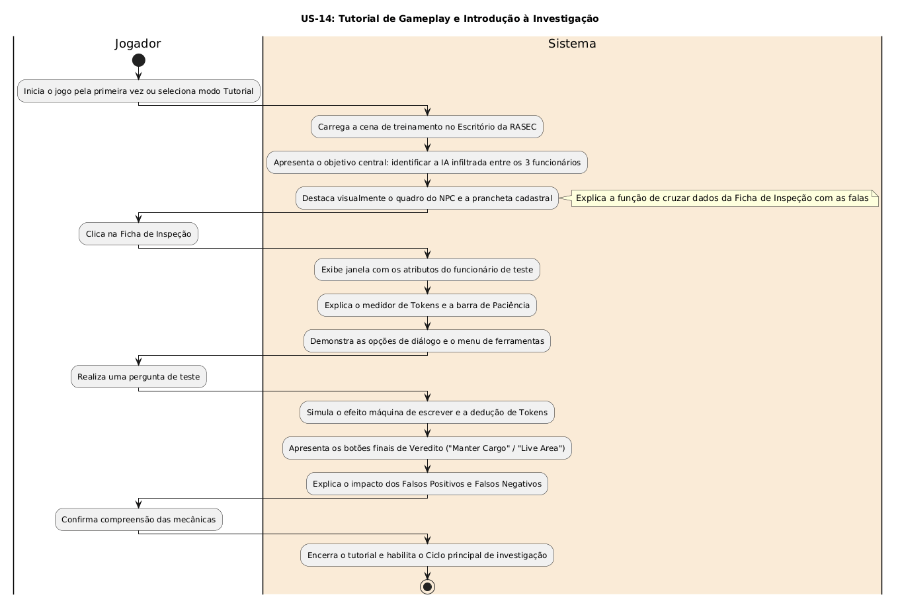

# US-14: Tutorial de Gameplay e Introdução à Investigação

[← Voltar para a lista de diagramas](./README.md)

### Cartão
> Como jogador, eu quero entender rapidamente o objetivo principal da mecânica de gameplay, para que eu saiba como interagir com o sistema sem complicações excessivas.

### Conversa
* Apresentação didática das ferramentas de inspeção, botões da interface, consumo de tokens, medidor de paciência e mecânica de veredito no início da jornada.

### Confirmação
* O Tutorial explicita o objetivo de cada botão e recurso utilizado na gameplay.

---

### Diagrama de Atividades (UML)

* **Código-fonte:** [`diagrama_us14.txt`](./diagrama_us14.txt)

