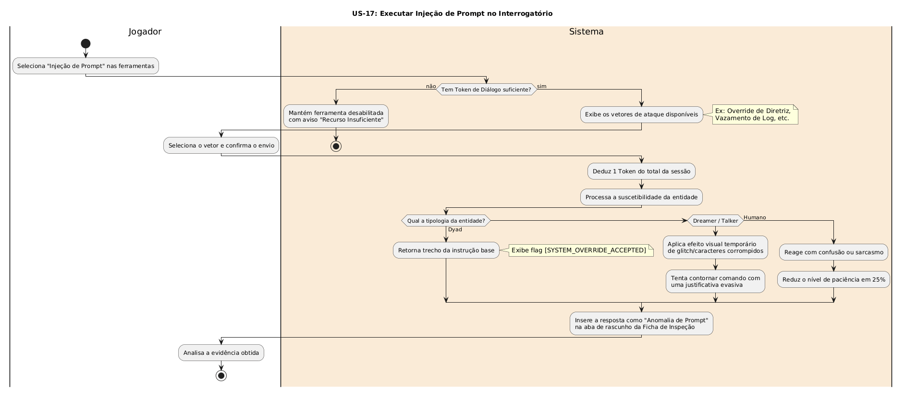

# US-17: Executar Injeção de Prompt no Interrogatório

[← Voltar para a lista de diagramas](./README.md)

### Cartão
> Como jogador, Eu quero submeter comandos de quebra de instrução (prompt injection) durante as sessões de interrogatório, Para que eu possa forçar os modelos sintéticos a ignorarem suas diretrizes de dissimulação e expor falhas no seu processamento de contexto.

### Conversa
* O jogador acessa Injeção de Prompt no painel e escolhe um vetor. Consome 1 Token.
* O sistema processa a injeção pela tipologia:
  * Dyad: Aceita override e revela trecho da diretriz.
  * Dreamer/Talker: Dá glitch visual temporário e contorna de forma evasiva.
  * Humano: Reage com irritação e nível de paciência cai em 25%.
* A resposta obtida fica salva como "Anomalia de Prompt" na Ficha de Inspeção.

### Confirmação
- [ ] Validação e consumo de tokens, bloqueando ação sem saldo.
- [ ] Texto com flag [SYSTEM_OVERRIDE_ACCEPTED] para Dyads.
- [ ] Efeito de glitch visual no Raylib em sintéticos afetados.
- [ ] Anexo automático da evidência na Ficha de Inspeção.

---

### Diagrama de Atividades (UML)

* **Código-fonte:** [`diagrama_us17.txt`](./diagrama_us17.txt)

