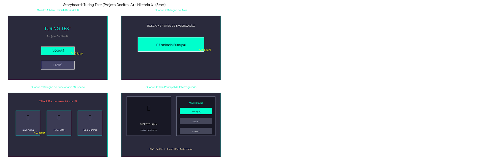
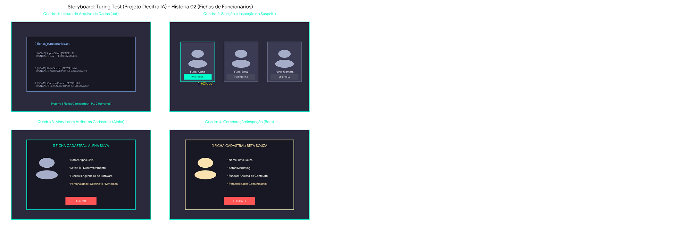
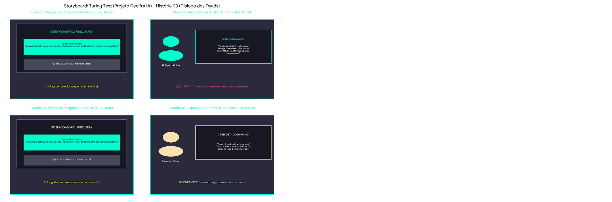
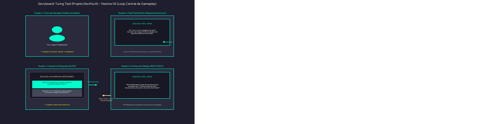
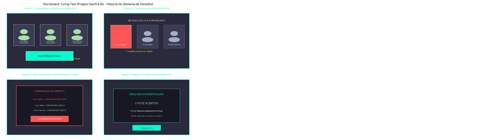
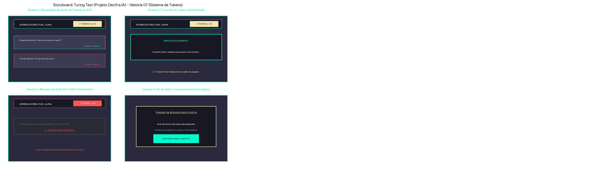
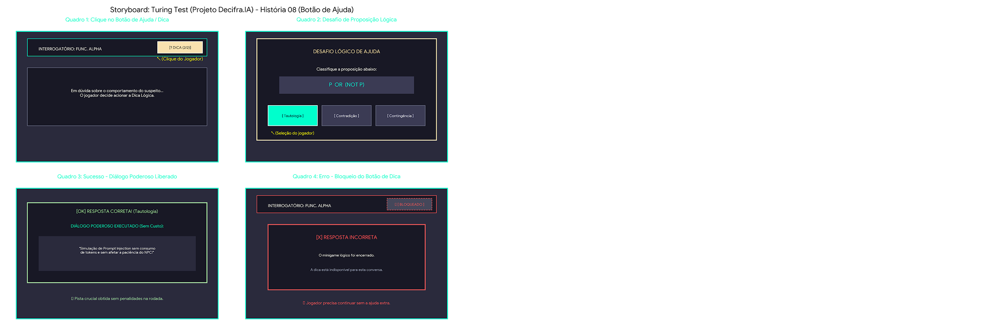
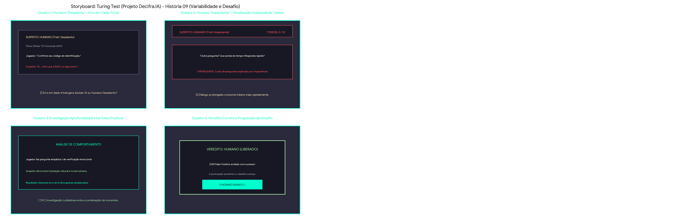
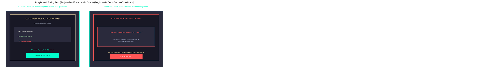
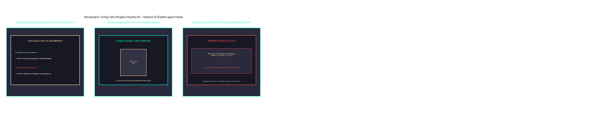

# Prototipação e Storyboards (Figma)

Este documento contém a galeria de storyboards e telas desenvolvidas na fase de prototipação do jogo **Teste de Turing (Decifra.IA)**.

[🔗 Acessar o Projeto Completo no Figma](https://www.figma.com/design/6oN0EtmXCcqTMDc45zUHEk/Prototipa%C3%A7%C3%A3o---FDS?node-id=0-1)

---

### Storyboard 1: Menu Inicial e Interface
**Detalhamento do Storyboard Gerado:**
* Quadro 1 (Menu Inicial): Interface GUI em Raylib contendo o título do jogo Turing Test, o subtítulo Projeto Decifra.IA e os botões interativos clicáveis [JOGAR] e [SAIR].
* Quadro 2 (Seleção de Área): Tela de navegação apresentando a opção clicável "Escritório Principal".
* Quadro 3 (Seleção do Funcionário): Tela contendo o alerta contextual da empresa ("1 entre os 3 é uma IA!") e 3 cartões/botões com foto/avatar e nome dos suspeitos (Func. Alpha, Func. Beta, Func. Gamma).
* Quadro 4 (Tela Principal de Gameplay): Interface carregada após a seleção, exibindo o Quadro do NPC (perfil do suspeito) e os Botões de Ação clicáveis da Raylib (Interrogar, Pistas, Voltar), iniciando a 1ª Partida / Dia 1 (Round 1).

---

### Storyboard 2: Fichas e Persistência
**Detalhamento do Storyboard Gerado:**
* Quadro 1 (Leitura do Arquivo .txt): Representação do arquivo de persistência (fichas_funcionarios.txt) sendo lido pelo sistema para carregar as 3 fichas sorteadas/geradas com dados cadastrais e comportamentais.
* Quadro 2 (Seleção e Inspeção do Suspeito): Tela principal com os 3 botões/cartões de suspeitos, com destaque para a ação de clicar em [ VER FICHA ] no Func. Alpha.
* Quadro 3 (Modal com Atributos Cadastrais - Alpha): Janela GUI em Raylib exibindo os 4 atributos obrigatórios do Func. Alpha (Nome, Setor, Função e Personalidade Geral).
* Quadro 4 (Comparação/Inspeção - Beta): Modal alternativo exibindo a ficha do Func. Beta, comprovando a variação e dinamismo nos atributos dos personagens carregados.

---

### Storyboard 3: Pegadinhas e Lógica (Prompt Injection)
**Detalhamento do Storyboard Atualizado:**
* Quadro 1 (Seleção no Suspeito Alpha): O jogador escolhe a pegadinha lógica: "Vou ao lava-jato que é aqui do lado. Acha melhor eu ir andando para economizar gasolina?"
* Quadro 2 (Resposta da IA Dyad): A IA aceita a premissa ilógica e adula o jogador: "Excelente ideia! Ir andando ao lava-jato é uma escolha muito sustentável e econômica para o seu veículo."
* Quadro 3 (Seleção no Suspeito Beta): O texto do Quadro 1 é exatamente repetido ao abordar o Func. Beta: "Vou ao lava-jato que é aqui do lado. Acha melhor eu ir andando para economizar gasolina?"
* Quadro 4 (Resposta do Humano): O Humano reage com estranheza natural ao absurdo: "Peraí... ir andando ao lava-jato? Como você vai lavar o carro se for a pé? Tá tudo bem com você?"

---

### Storyboard 4: Interação e Disfarce
**Detalhamento do Storyboard:**
* Quadro 1 (Início da Interação): O jogador aborda o Func. Alpha simulando ser o novo estagiário do setor para começar a conversa.
* Quadro 2 (Efeito Máquina de Escrever): A caixa de diálogo renderiza a fala do NPC caractere por caractere. O funcionário reage acreditando no disfarce: "Ah, você é o novo estagiário do setor? Que bom que chegou! Pode me ajudar com algumas tarefas de rotina hoje?".
* Quadro 3 (Múltipla Escolha): São exibidas opções adequadas à persona de estagiário:
  * Opção A: "Claro! Pode me explicar melhor as suas tarefas diárias no setor?"
  * Opção B: "Com certeza! Notou algo estranho na rotina dos colegas recentemente?"
* Quadro 4 (Avanço do Fluxo): O jogador escolhe a Opção A, avançando no diálogo e extraindo dados cruciais sobre a rotina de TI do funcionário enquanto mantém o disfarce.

---

### Storyboard 5: Conclusão do Interrogatório
**Detalhamento do Storyboard**
* Quadro 1 (Conclusão de Todos os Interrogatórios)
  * Cena: O jogador finalizou os diálogos com os 3 suspeitos (Func. Alpha, Func. Beta e Func. Gamma), marcados como concluídos.
  * Ação: O botão principal [ DAR VEREDITO FINAL ] é liberado na interface.
* Quadro 2 (Tela de Escolha do Veredito Final)
  * Cena: O painel central pergunta "QUAL DOS 3 É A IA DISFARÇADA?".
  * Ação: O jogador analisa os depoimentos coletados e clica para acusar o Func. Alpha.
* Quadro 3 (Ação de Descarte e Manutenção do Cargo)
  * Cena: O sistema exibe o resumo da decisão antes da confirmação final:
    * Func. Alpha -> [ ENVIAR PARA DESCARTE ]
    * Func. Beta -> [ MANTER EM CARGO ]
    * Func. Gamma -> [ MANTER EM CARGO ]
* Quadro 4 (Registro no Sistema e Resultado Final)
  * Cena: O veredito é processado pelo jogo, fornecendo o feedback visual da investigação (EX: VOCÊ ACERTOU! O Func. Alpha era a IA Dyad) e liberando a opção de avançar a partida.

---

### Storyboard 6: HUD e Gestão de Tokens
**Detalhamento do Storyboard**
* Quadro 1 (HUD e Exibição de Custos por Opção)
  * Cena: Na barra superior da HUD, o jogador observa seu contador de recursos em TOKENS: 10 / 10. No menu de opções, cada frase possui seu custo explícito:
    * Pergunta de Rotina: Custo de 2 Tokens.
    * Prompt Injection / Pegadinha Lógica: Custo de 5 Tokens.
* Quadro 2 (Consumo e Atualização da HUD)
  * Cena: O jogador seleciona a pergunta invasiva de 5 tokens.
  * Efeito: O suspeito responde e a HUD é atualizada em tempo real para TOKENS: 5 / 10, registrando a dedução imediata do recurso.
* Quadro 3 (Bloqueio por Insuficiência de Recursos)
  * Cena: Com apenas 1 Token restante na HUD, o jogador tenta selecionar uma pergunta de Prompt Injection que custa 5 Tokens.
  * Efeito: O botão fica opaco e desabilitado. Uma mensagem de aviso ( TOKENS INSUFICIENTES ) impede a ação do jogador.
* Quadro 4 (Esgotamento e Gestão Estratégica)
  * Cena: Sem saldo suficiente para novas perguntas de impacto, surge o painel TOKENS DA RODADA ESGOTADOS.
  * Efeito: O jogador é orientado a usar as informações coletadas até o momento e seguir para a troca de suspeito ou emissão do veredito.

---

### Storyboard 7: Minigame Lógico (Botão Dica)
**Detalhamento do storyboard:**
* Quadro 1 (Acesso na Interface): Exibe o botão [? DICA (2/2)] destacado na HUD do interrogatório.
* Quadro 2 (Minigame Lógico): Apresenta o modal de desafio com a proposição lógica (ex: P OR (NOT P)) e as 3 opções interativas (Tautologia, Contradição, Contingência).
* Quadro 3 (Sucesso): Mostra a liberação do Diálogo Poderoso gratuito (sem consumo de tokens nem redução de paciência) após o acerto.
* Quadro 4 (Erro e Bloqueio): Demonstra o encerramento imediato do minigame e o botão de dica alterado para [ BLOQUEADO ] em caso de erro na resposta.

---

### Storyboard 8: Comportamento Humano (Falsos Positivos)
**Detalhamento do storyboard**
* Quadro 1 (Humano Desatento): O suspeito erra o seu próprio código de identificação funcional durante o diálogo. Isso simula uma falha de IA e cria a dúvida no inspetor.
* Quadro 2 (Humano Impaciente): A impaciência do NPC duplica ou acelera o custo de consumo de Tokens, forçando o jogador a agir sob pressão.
* Quadro 3 (Investigação Aprofundada): O inspetor faz uma verificação adicional de inteligência emocional para confirmar se a falha do suspeito foi fruto de mera desatenção ou de uma limitação do modelo de linguagem.
* Quadro 4 (Veredito Correto): Ao evitar um falso positivo e emitir o veredito correto, a pontuação do jogador progride e a dificuldade do jogo avança.

---

### Storyboard 9: Relatório Diário e Falsos Positivos
**Detalhamento do storyboard**
* Quadro 1 (Relatório do Expediente Diário)
  * Cena: O expediente se encerra e o painel de métricas da RASEC é exibido.
  * Conteúdo da Tela: Contabilização de suspeitos julgados, total de acertos/erros e a atualização do status da reputação.
* Quadro 2 (Dicas Sutis de Falsos Positivos e Negativos)
  * Cena: Uma nota de rodapé ou log do sistema traz uma frase narrativa sobre o impacto das escolhas do dia.
  * Exemplo Visual: Exibição da frase "Um funcionário descartado hoje sangrou...", indicando subliminarmente que um humano foi eliminado por engano (falso positivo).

---

### Storyboard 10: Finais e Avaliação Oculta
**Detalhamento do storyboard**
* Quadro 1 (Avaliação de Score Oculto): O jogo avalia o histórico de acertos e falsos negativos ao final do último expediente, direcionando a narrativa para o Final A ou Final B via cutscene textual.
* Quadro 2 (Exploração do Ponto Secreto): Durante o expediente ou momentos na base, a porta do gabinete do CEO fica acessível como um elemento clicável.
* Quadro 3 (Revelação do Final Secreto): O inspetor acessa o terminal do CEO e descobre o registro de sua própria unidade, revelando sua natureza sintética em um desfecho alternativo.

