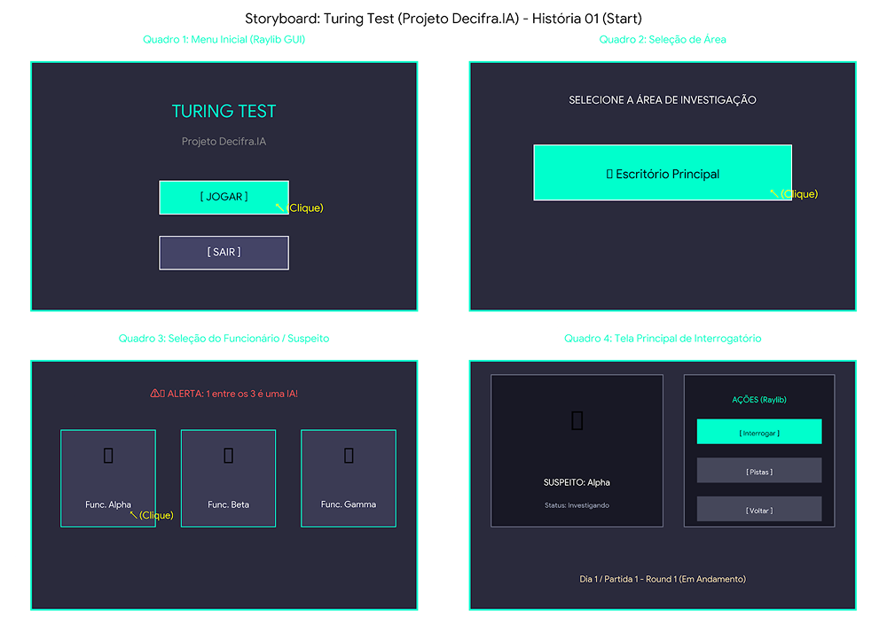

# SB-01: Menu Inicial e Interface

[← Voltar para a lista de storyboards](./README.md)

### Visualização

### Detalhamento
* Quadro 1 (Menu Inicial): Interface GUI em Raylib contendo o título do jogo Turing Test, o subtítulo Projeto Decifra.IA e os botões interativos clicáveis [JOGAR] e [SAIR].
* Quadro 2 (Seleção de Área): Tela de navegação apresentando a opção clicável "Escritório Principal".
* Quadro 3 (Seleção do Funcionário): Tela contendo o alerta contextual da empresa ("1 entre os 3 é uma IA!") e 3 cartões/botões com foto/avatar e nome dos suspeitos (Func. Alpha, Func. Beta, Func. Gamma).
* Quadro 4 (Tela Principal de Gameplay): Interface carregada após a seleção, exibindo o Quadro do NPC (perfil do suspeito) e os Botões de Ação clicáveis da Raylib (Interrogar, Pistas, Voltar), iniciando a 1ª Partida / Dia 1 (Round 1).
