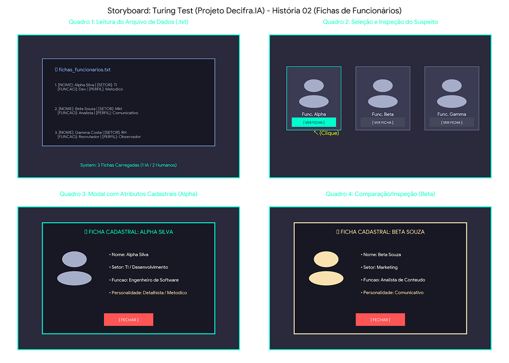

# SB-02: Fichas e Persistência

[← Voltar para a lista de storyboards](./README.md)

### Visualização

### Detalhamento
* Quadro 1 (Leitura do Arquivo .txt): Representação do arquivo de persistência (fichas_funcionarios.txt) sendo lido pelo sistema para carregar as 3 fichas sorteadas/geradas com dados cadastrais e comportamentais.
* Quadro 2 (Seleção e Inspeção do Suspeito): Tela principal com os 3 botões/cartões de suspeitos, com destaque para a ação de clicar em [ VER FICHA ] no Func. Alpha.
* Quadro 3 (Modal com Atributos Cadastrais - Alpha): Janela GUI em Raylib exibindo os 4 atributos obrigatórios do Func. Alpha (Nome, Setor, Função e Personalidade Geral).
* Quadro 4 (Comparação/Inspeção - Beta): Modal alternativo exibindo a ficha do Func. Beta, comprovando a variação e dinamismo nos atributos dos personagens carregados.
