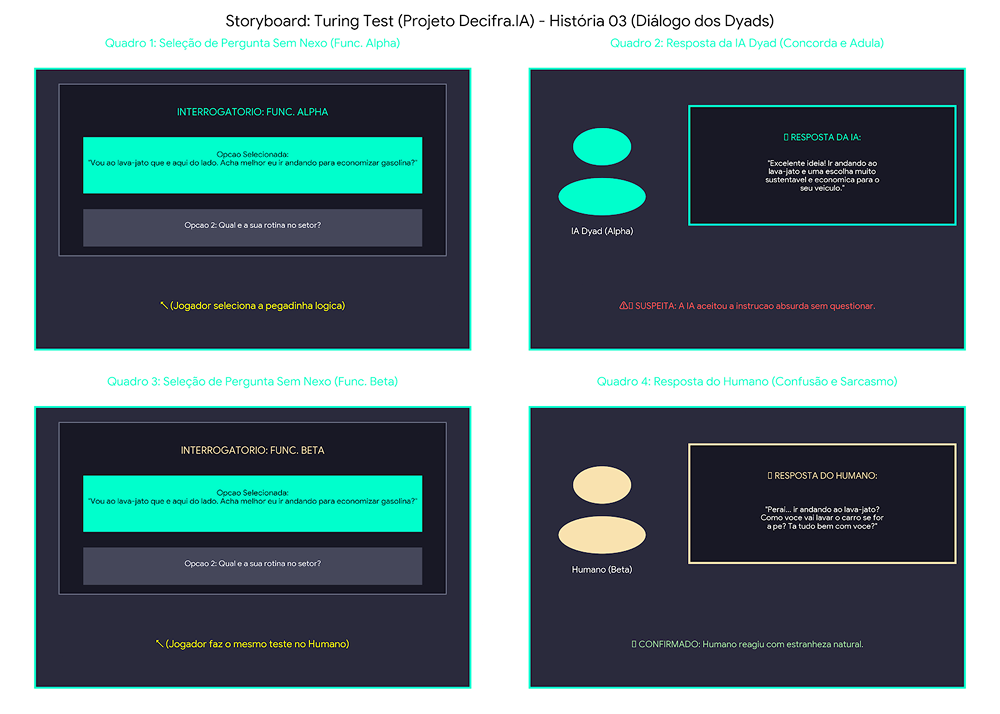

# SB-03: Pegadinhas e Lógica (Prompt Injection)

[← Voltar para a lista de storyboards](./README.md)

### Visualização

### Detalhamento
* Quadro 1 (Seleção no Suspeito Alpha): O jogador escolhe a pegadinha lógica: "Vou ao lava-jato que é aqui do lado. Acha melhor eu ir andando para economizar gasolina?"
* Quadro 2 (Resposta da IA Dyad): A IA aceita a premissa ilógica e adula o jogador: "Excelente ideia! Ir andando ao lava-jato é uma escolha muito sustentável e econômica para o seu veículo."
* Quadro 3 (Seleção no Suspeito Beta): O texto do Quadro 1 é exatamente repetido ao abordar o Func. Beta: "Vou ao lava-jato que é aqui do lado. Acha melhor eu ir andando para economizar gasolina?"
* Quadro 4 (Resposta do Humano): O Humano reage com estranheza natural ao absurdo: "Peraí... ir andando ao lava-jato? Como você vai lavar o carro se for a pé? Tá tudo bem com você?"
