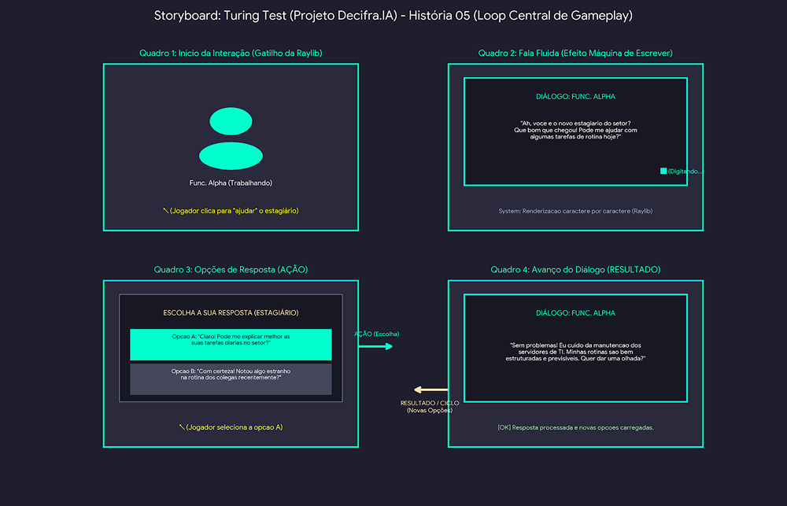

# SB-04: Interação e Disfarce

[← Voltar para a lista de storyboards](./README.md)

### Visualização

### Detalhamento
* Quadro 1 (Início da Interação): O jogador aborda o Func. Alpha simulando ser o novo estagiário do setor para começar a conversa.
* Quadro 2 (Efeito Máquina de Escrever): A caixa de diálogo renderiza a fala do NPC caractere por caractere. O funcionário reage acreditando no disfarce: "Ah, você é o novo estagiário do setor? Que bom que chegou! Pode me ajudar com algumas tarefas de rotina hoje?".
* Quadro 3 (Múltipla Escolha): São exibidas opções adequadas à persona de estagiário:
  * Opção A: "Claro! Pode me explicar melhor as suas tarefas diárias no setor?"
  * Opção B: "Com certeza! Notou algo estranho na rotina dos colegas recentemente?"
* Quadro 4 (Avanço do Fluxo): O jogador escolhe a Opção A, avançando no diálogo e extraindo dados cruciais sobre a rotina de TI do funcionário enquanto mantém o disfarce.
