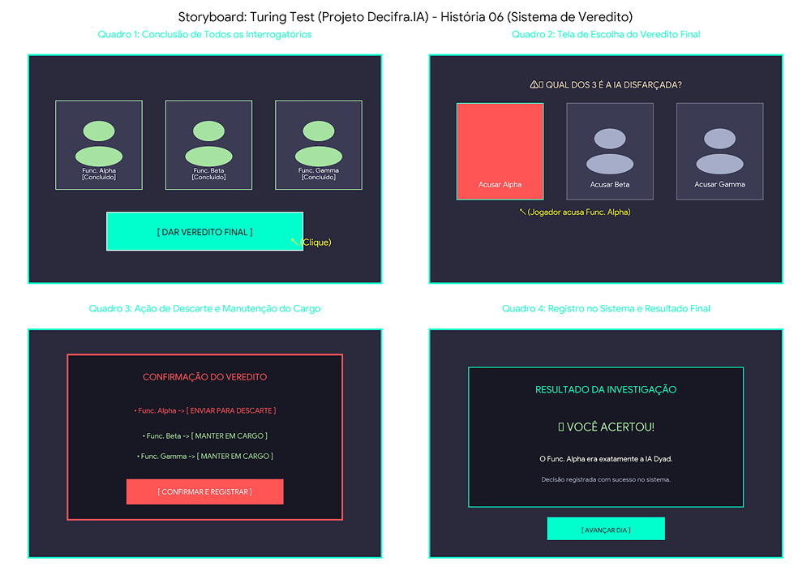

# SB-05: Conclusão do Interrogatório

[← Voltar para a lista de storyboards](./README.md)

### Visualização

### Detalhamento
* Quadro 1 (Conclusão de Todos os Interrogatórios)
  * Cena: O jogador finalizou os diálogos com os 3 suspeitos (Func. Alpha, Func. Beta e Func. Gamma), marcados como concluídos.
  * Ação: O botão principal [ DAR VEREDITO FINAL ] é liberado na interface.
* Quadro 2 (Tela de Escolha do Veredito Final)
  * Cena: O painel central pergunta "QUAL DOS 3 É A IA DISFARÇADA?".
  * Ação: O jogador analisa os depoimentos coletados e clica para acusar o Func. Alpha.
* Quadro 3 (Ação de Descarte e Manutenção do Cargo)
  * Cena: O sistema exibe o resumo da decisão antes da confirmação final:
    * Func. Alpha -> [ ENVIAR PARA DESCARTE ]
    * Func. Beta -> [ MANTER EM CARGO ]
    * Func. Gamma -> [ MANTER EM CARGO ]
* Quadro 4 (Registro no Sistema e Resultado Final)
  * Cena: O veredito é processado pelo jogo, fornecendo o feedback visual da investigação (EX: VOCÊ ACERTOU! O Func. Alpha era a IA Dyad) e liberando a opção de avançar a partida.
