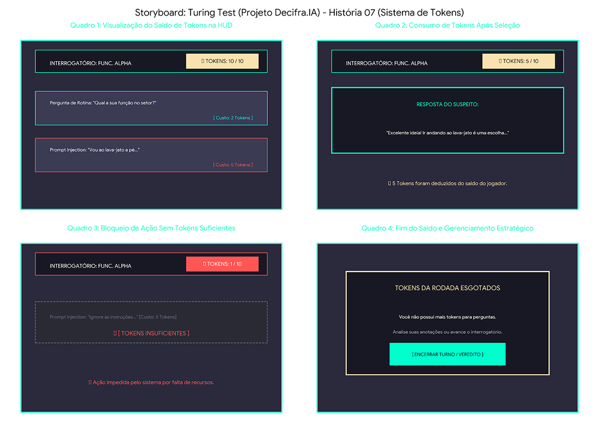

# SB-06: HUD e Gestão de Tokens

[← Voltar para a lista de storyboards](./README.md)

### Visualização

### Detalhamento
* Quadro 1 (HUD e Exibição de Custos por Opção)
  * Cena: Na barra superior da HUD, o jogador observa seu contador de recursos em TOKENS: 10 / 10. No menu de opções, cada frase possui seu custo explícito:
    * Pergunta de Rotina: Custo de 2 Tokens.
    * Prompt Injection / Pegadinha Lógica: Custo de 5 Tokens.
* Quadro 2 (Consumo e Atualização da HUD)
  * Cena: O jogador seleciona a pergunta invasiva de 5 tokens.
  * Efeito: O suspeito responde e a HUD é atualizada em tempo real para TOKENS: 5 / 10, registrando a dedução imediata do recurso.
* Quadro 3 (Bloqueio por Insuficiência de Recursos)
  * Cena: Com apenas 1 Token restante na HUD, o jogador tenta selecionar uma pergunta de Prompt Injection que custa 5 Tokens.
  * Efeito: O botão fica opaco e desabilitado. Uma mensagem de aviso ( TOKENS INSUFICIENTES ) impede a ação do jogador.
* Quadro 4 (Esgotamento e Gestão Estratégica)
  * Cena: Sem saldo suficiente para novas perguntas de impacto, surge o painel TOKENS DA RODADA ESGOTADOS.
  * Efeito: O jogador é orientado a usar as informações coletadas até o momento e seguir para a troca de suspeito ou emissão do veredito.
