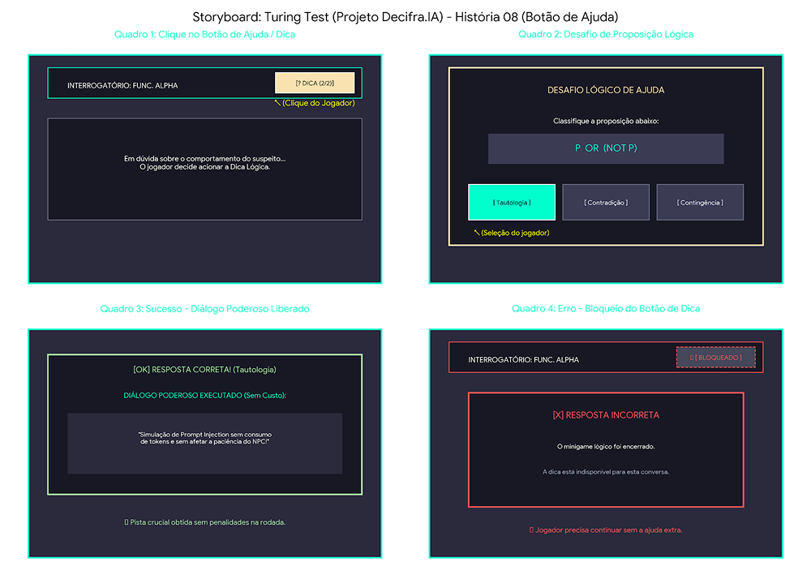

# SB-07: Minigame Lógico (Botão Dica)

[← Voltar para a lista de storyboards](./README.md)

### Visualização

### Detalhamento
* Quadro 1 (Acesso na Interface): Exibe o botão [? DICA (2/2)] destacado na HUD do interrogatório.
* Quadro 2 (Minigame Lógico): Apresenta o modal de desafio com a proposição lógica (ex: P OR (NOT P)) e as 3 opções interativas (Tautologia, Contradição, Contingência).
* Quadro 3 (Sucesso): Mostra a liberação do Diálogo Poderoso gratuito (sem consumo de tokens nem redução de paciência) após o acerto.
* Quadro 4 (Erro e Bloqueio): Demonstra o encerramento imediato do minigame e o botão de dica alterado para [ BLOQUEADO ] em caso de erro na resposta.
