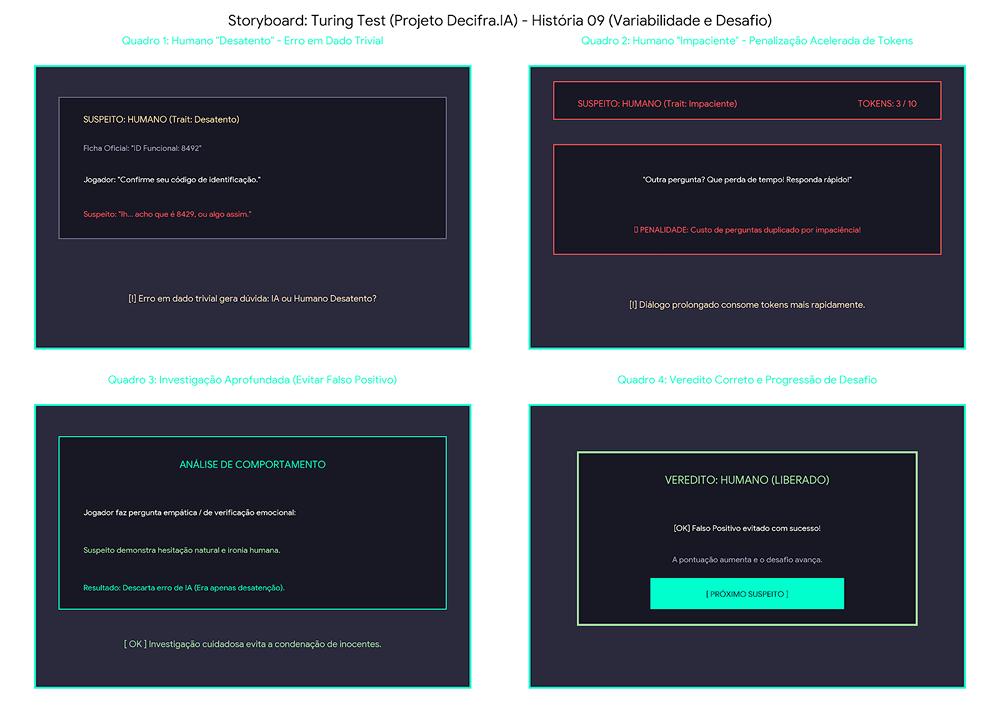

# SB-08: Comportamento Humano (Falsos Positivos)

[← Voltar para a lista de storyboards](./README.md)

### Visualização

### Detalhamento
* Quadro 1 (Humano Desatento): O suspeito erra o seu próprio código de identificação funcional durante o diálogo. Isso simula uma falha de IA e cria a dúvida no inspetor.
* Quadro 2 (Humano Impaciente): A impaciência do NPC duplica ou acelera o custo de consumo de Tokens, forçando o jogador a agir sob pressão.
* Quadro 3 (Investigação Aprofundada): O inspetor faz uma verificação adicional de inteligência emocional para confirmar se a falha do suspeito foi fruto de mera desatenção ou de uma limitação do modelo de linguagem.
* Quadro 4 (Veredito Correto): Ao evitar um falso positivo e emitir o veredito correto, a pontuação do jogador progride e a dificuldade do jogo avança.
