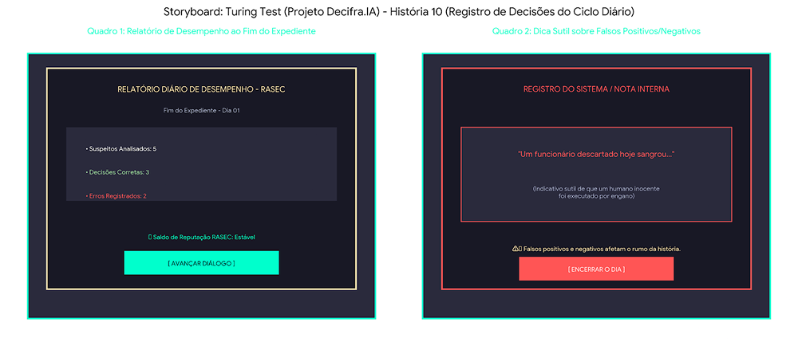

# SB-09: Relatório Diário e Falsos Positivos

[← Voltar para a lista de storyboards](./README.md)

### Visualização

### Detalhamento
* Quadro 1 (Relatório do Expediente Diário)
  * Cena: O expediente se encerra e o painel de métricas da RASEC é exibido.
  * Conteúdo da Tela: Contabilização de suspeitos julgados, total de acertos/erros e a atualização do status da reputação.
* Quadro 2 (Dicas Sutis de Falsos Positivos e Negativos)
  * Cena: Uma nota de rodapé ou log do sistema traz uma frase narrativa sobre o impacto das escolhas do dia.
  * Exemplo Visual: Exibição da frase "Um funcionário descartado hoje sangrou...", indicando subliminarmente que um humano foi eliminado por engano (falso positivo).
