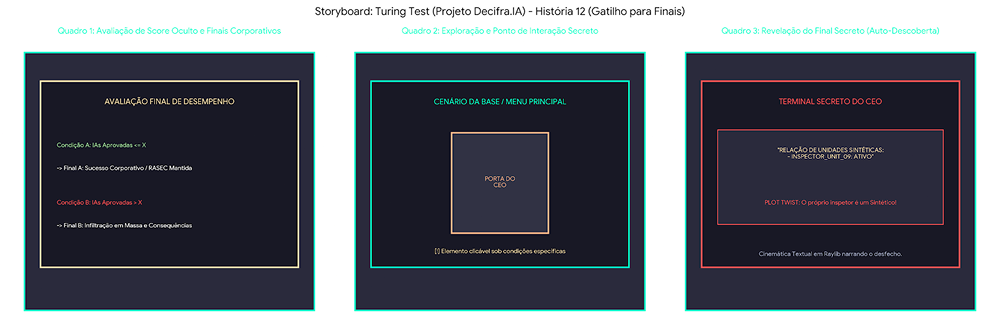

# SB-10: Finais e Avaliação Oculta

[← Voltar para a lista de storyboards](./README.md)

### Visualização

### Detalhamento
* Quadro 1 (Avaliação de Score Oculto): O jogo avalia o histórico de acertos e falsos negativos ao final do último expediente, direcionando a narrativa para o Final A ou Final B via cutscene textual.
* Quadro 2 (Exploração do Ponto Secreto): Durante o expediente ou momentos na base, a porta do gabinete do CEO fica acessível como um elemento clicável.
* Quadro 3 (Revelação do Final Secreto): O inspetor acessa o terminal do CEO e descobre o registro de sua própria unidade, revelando sua natureza sintética em um desfecho alternativo.
